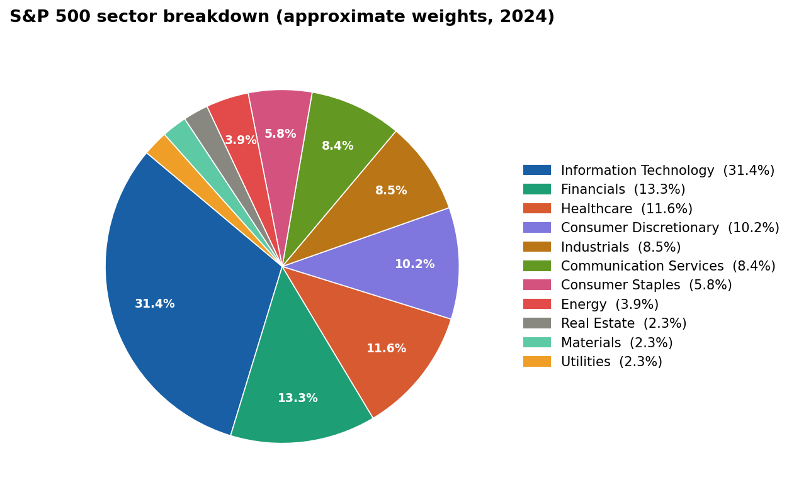

# Can a Machine Tell You Whether the Stock Market Will Go Up Tomorrow?

## A Data Science Project Uses Price History and Economic Data to Predict Daily Stock Market Direction

---

## Hook

You have probably checked the stock market at some point and had no idea what was going to happen next. That uncertainty is completely normal. But what if a machine could make a slightly better guess, just by reading patterns in the data that are too subtle for a person to catch on their own?

## Problem Statement

Stock prices change every day, and the reasons why are not always obvious. Past price patterns and broader economic conditions both play a role, but it is not clear how much each one matters. This project sets out to answer that question in a structured, measurable way.

## Solution Description

This project pulls together two types of publicly available data: daily stock price history and economic indicators published by the Federal Reserve. All of it is stored in a database and fed into a machine learning model that predicts whether each of eleven market sectors will go up or down the following day. Rather than treating the whole stock market as one single thing, the project models each sector separately, because sectors like healthcare and energy behave very differently from each other depending on what is happening in the economy.

## Chart

The United States stock market is divided into eleven sectors, each representing a different part of the economy. The chart below shows how those sectors are distributed by size. This project models each one separately rather than lumping them all together, which gives a more accurate picture of how different parts of the market behave under the same economic conditions.

